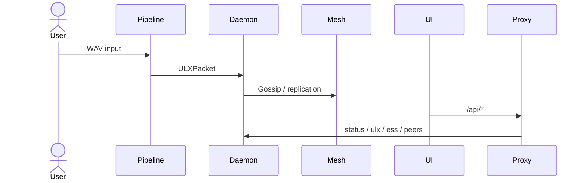

# HGI-MX — Human Grounded Intelligence Mesh

## Overview (EN)

**HGI-MX (Human Grounded Intelligence Mesh)** is a privacy-first emotional AI pipeline designed around **synthetic-only** outputs.

Pipeline (high level):

`EVA → AF → HEV → MOLIE → BIPS → ULX → ESS → Mesh`

Key guarantees:

- **Privacy-first**: UI and APIs avoid displaying PII-like fields.
- **Synthetic-only**: downstream artifacts are synthetic representations (not raw human data).
- **Irreversible shards (BIPS)**: shards are designed to be non-reconstructive.

## Resumen (ES)

**HGI-MX (Human Grounded Intelligence Mesh)** es un pipeline de IA emocional con enfoque **privacy-first** y salidas **sintéticas**.

Pipeline (alto nivel):

`EVA → AF → HEV → MOLIE → BIPS → ULX → ESS → Mesh`

Garantías:

- **Privacidad primero**: la UI y los endpoints evitan exponer campos tipo PII.
- **Solo sintético**: los artefactos son representaciones sintéticas (no datos humanos crudos).
- **Shards irreversibles (BIPS)**: el diseño evita reconstrucción.

## Quickstart

1. `pnpm i`
2. `pnpm setup:real` (downloads models)
3. Copy `.env.example` → `.env.local`
4. `pnpm pipeline-run audio.wav` (E2E test)
5. `pnpm node-start` (daemon)
6. `pnpm ui-start` (UI + proxy)

## Commands

### Core pipeline / CLI

- `pnpm eva`
- `pnpm af`
- `pnpm hev`
- `pnpm molie`
- `pnpm bips`
- `pnpm ulx-run`
- `pnpm ess-list`
- `pnpm ess-show`
- `pnpm pipeline-run <path/to/audio.wav>`

### Mesh / Daemon

- `pnpm node-start`
- `pnpm node-status`
- `pnpm mesh`
- `pnpm mesh-peers`
- `pnpm daemon`
- `pnpm mesh-local-sim`

### Server

- `pnpm server`

### UI

- `pnpm ui-start` (starts UI dev server + UI proxy)
- `pnpm ui-proxy`
- `pnpm ui-dev`
- `pnpm ui-build`

### Setup

- `pnpm setup` (models + install)
- `pnpm setup:models` (download models)
- `pnpm setup:real` (models + reminder to copy env)

### Tests

- `pnpm test`
- `pnpm test:smoke`
- `pnpm test:integration`
- `pnpm test:validation`
- `pnpm test:pipeline`
- `pnpm test:full`
- `pnpm test:onnx`
- `pnpm test:demo`
- `pnpm ui-test`
- `pnpm ui-test:ui`
- `pnpm ui-e2e`

## Architecture

## Roadmap

See: `docs/roadmap/roadmap-v1.md`

## Notes

- If you run into port conflicts, check `.env.local` and the UI proxy port env (`HGI_UI_PORT`).
- Playwright E2E tests use `pnpm ui-start` via `playwright.config.ts`.